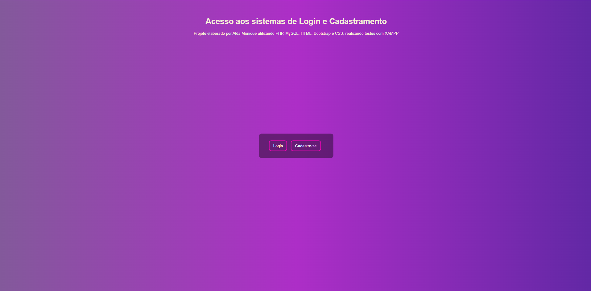
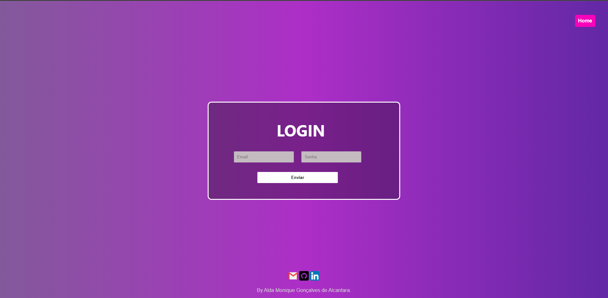
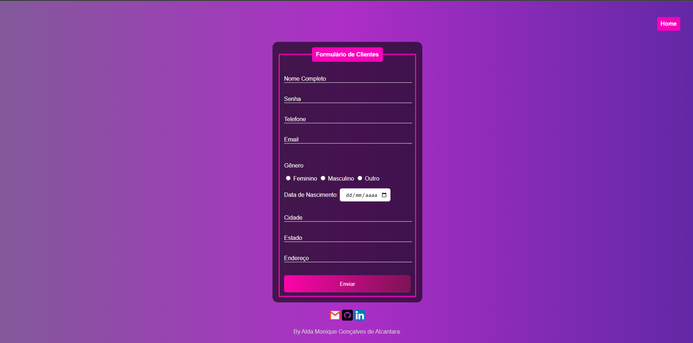

# Sobre 

Telas para sistemas de acesso para usuários com cadastro e login, utilizando PHP, MySQL, HTML e CSS; utilizando o pacote de servidores XAMPP.
O sistema realiza o cadastramento do usuário a partir de um formulário interligado ao banco de dados, onde o validará, para fins de acesso, com o método POST. As sessões
são validadas com o apoio do PHP, a partir de uma lógica que confere a paridade do que foi inserido na página de login e o que foi cadastrado; para então liberar a 
página de sistema. 

# Telas 

- Tela para acesso às páginas de login e cadastro
  

- Tela de login 
  

- Tela de Cadastro
  

